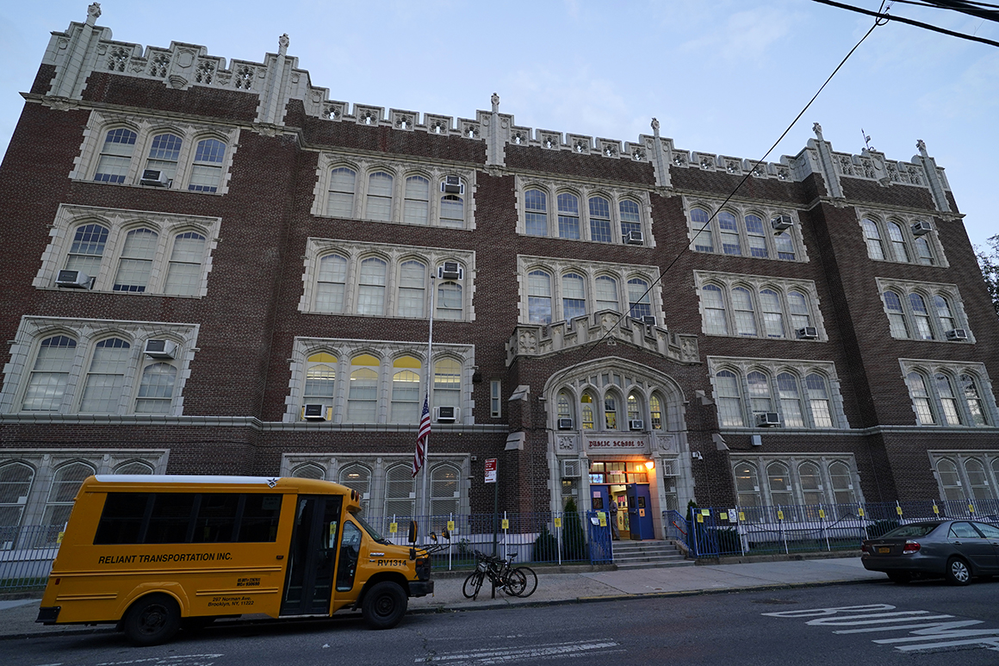
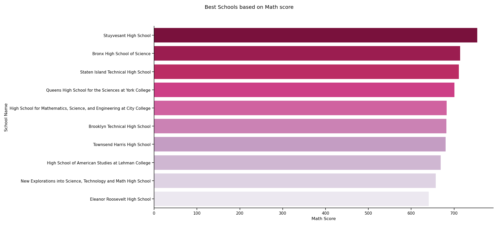
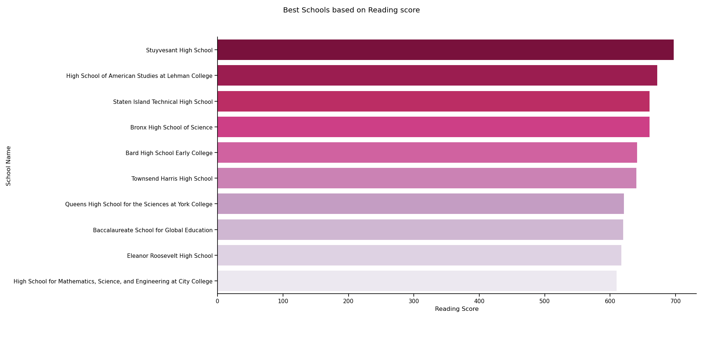
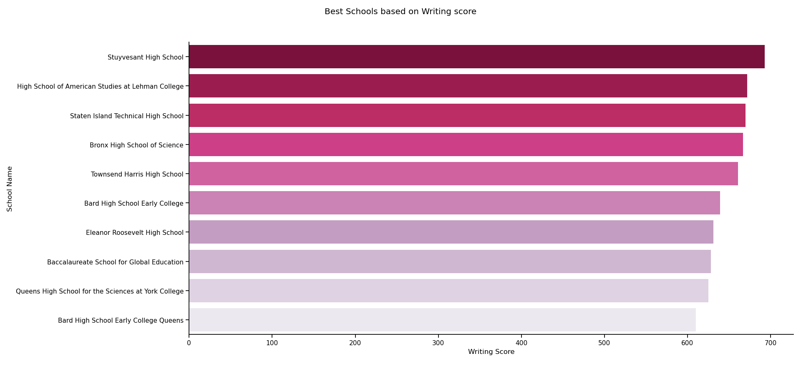
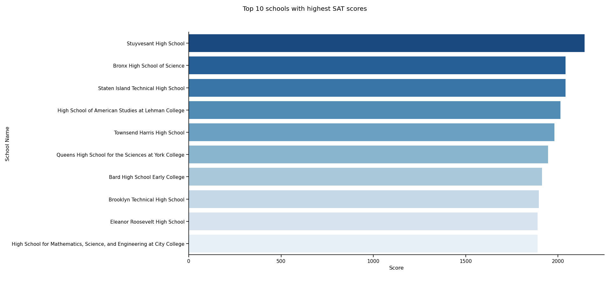
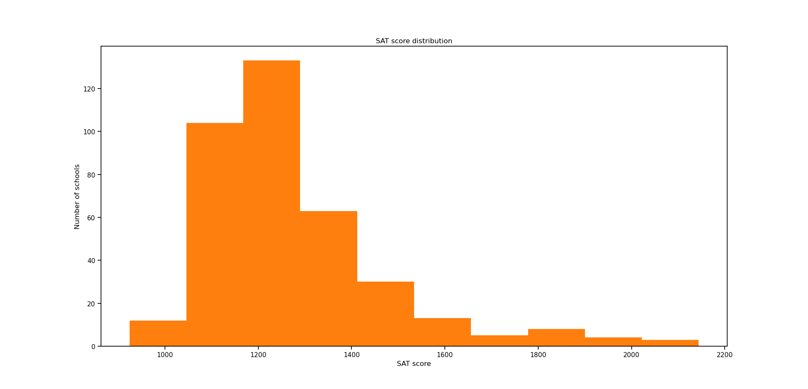
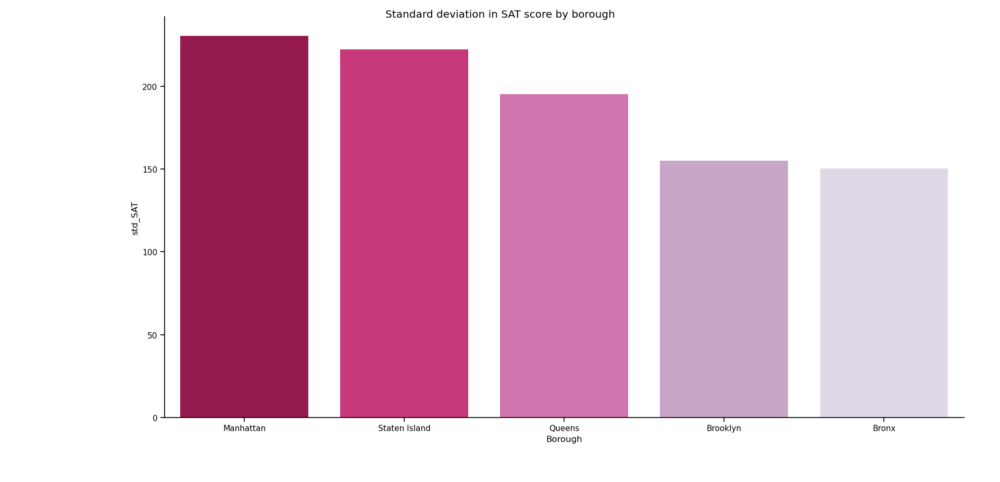

# 🏫 What I found about New York City Public Schools' SAT Performance:

## 🔢 Math scores:

🔹The average Math score of 375 public schools in New York City is **432.944** out of possible **800**.

🔹Top schools with best Math performance are: 
    
    - Stuyvesant High School
    - Bronx High School of Science
    - Staten Island Technical High School
    - Queens High School for the Sciences at York College
    - High School for Mathematics, Science, and Engineering at City College
    - Brooklyn Technical High School
    - Townsend Harris High School
    - High School of American Studies at Lehman College
    - New Explorations into Science, Technology and Math High School
    - Eleanor Roosevelt High School

## 📚 Reading scores:

🔹The average Reading score of 375 public schools in New York City is **424.504** out of possible **800**.

🔹Top schools with best Reading performance are:

    - Stuyvesant High School
    - High School of American Studies at Lehman College
    - Staten Island Technical High School
    - Bronx High School of Science
    - Bard High School Early College
    - Townsend Harris High School
    - Queens High School for the Sciences at York College
    - Baccalaureate School for Global Education
    - Eleanor Roosevelt High School
    - High School for Mathematics, Science, and Engineering at City College

## ✏️ Writing scores:

🔹The average Reading score of 375 public schools in New York City is **418.459** out of possible **800**.

🔹Top schools with best Writing performance are:

    - Stuyvesant High School
    - High School of American Studies at Lehman College
    - Staten Island Technical High School
    - Bronx High School of Science
    - Townsend Harris High School
    - Bard High School Early College
    - Eleanor Roosevelt High School
    - Baccalaureate School for Global Education
    - Queens High School for the Sciences at York College
    - Bard High School Early College Queens

#### 📌 As we can see from the above diagrams, Stuyvesant High School stands out as the leading school in all 3 subjects.

## 💯 Total SAT score

🔹The average SAT score of 375 public schools in New York City is **1275.907** out of possible **2400**.

🔹Top schools with highest total SAT scores are:

    - Stuyvesant High School
    - Bronx High School of Science
    - Staten Island Technical High School
    - High School of American Studies at Lehman College
    - Townsend Harris High School
    - Queens High School for the Sciences at York College
    - Bard High School Early College
    - Brooklyn Technical High School
    - Eleanor Roosevelt High School
    - High School for Mathematics, Science, and Engineering at City College

🔹As we can see from the histogram, the average SAT score of the majority of public schools in New York ranges from 1000 to 1400, only a small number of schools score above 1600. 

## 📍 Borough with uneven school quality:

🔹Top 5 boroughs with largest standard deviation of total SAT score are:

    - Manhattan   
    - Staten Island   
    - Queens   
    - Brooklyn   
    - Bronx

🔹Manhattan is the borough with largest SAT score deviation, which may indicate uneven distribution in schools' quality.

## 🧠 Skills used in this project:
    🔹Data handling and reading.
    🔹Working with CSV file using Pandas.
    🔹Data malnipulation:
        - Grouping
        - Sorting
        - Counting
        - Aggregating
        - Selecting
    🔹Data visulization using Seaborn and Matplotlib:
        - Histogram
        - Bar chart
        - Plot customization (layout, color pallete, labels, titles)
    

