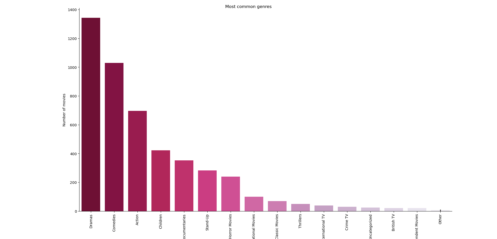
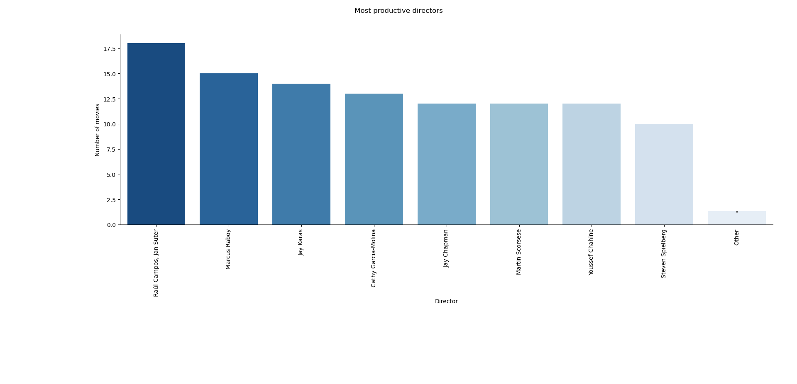
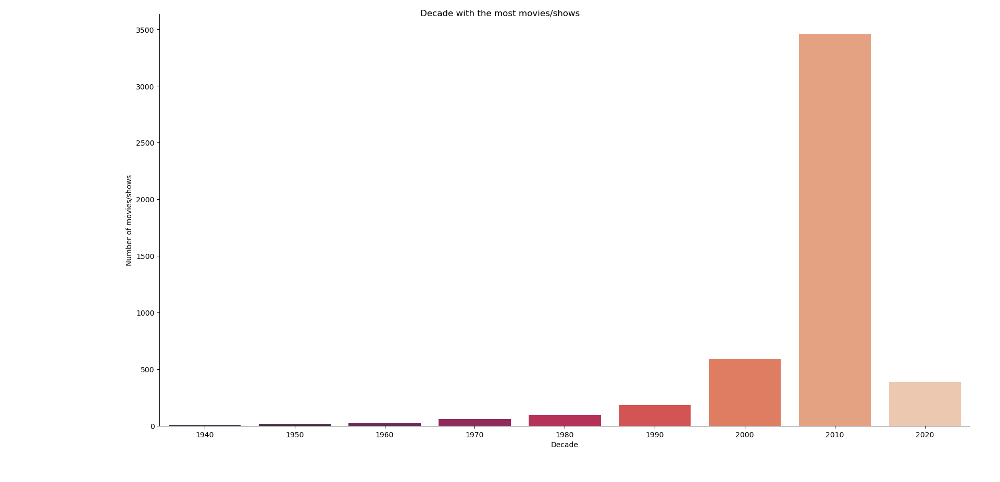
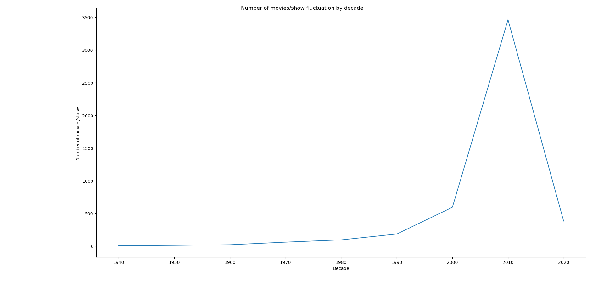

# 🍿 What I found about 79 years of Netflix movies:

## 🎬 Most common genres:

🔹Top 5 most common genres of Netflix movies from 1942-2021 are:

    - Dramas (1343 movies)
    - Comedies (1029 movies)
    - Action (696 movies)
    - Children (421 movies)
    - Documentaries (352 movies)

🔹While some genres are very popular, some are much less common:

    - Romantic movies
    - TV comedies (3 movies)
    - TV Action (2 movies)
    - Classic
    - Romantic TV
    - Reality TV 
    - LGBTQ movies 
    - TV horror (1 movie)

## 🎬 Most productive directors: 

🔹Raúl Campos and Jan Suter were the most productive pair of director during the time, they together produced a total of 18 movies/shows in 79 years.

🔹Campos and Suter were followed by Marcus Raboy (15 movies/shows) and Jay Karas (14 movies/shows).

## 📅 Decade with the most movies/shows:

🔹 The 2010s is the decade that had the most movies/shows, with 3461 movies/shows in total, this can be interpreted for some reasons:
    
    🌐 The Internet booming paving the way for:
    - Viral marketing
    - Easier access to Netlix platforms
    - Netflix's switching from DVDs to streaming in 2007

🔹From the 2020s decade, due to the Covid-19 pandemic, the numbers of movies/shows declined sharply.

📌 *As we can see from the line chart, the fluctuation is very significant.*

## 🧠 Skills used in this project:

    🔹Data handling and reading.
    🔹Working with csv file using Pandas.
    🔹Data manipulation using Pandas:
        - Counting
        - Grouping
        - Selecting
        - Filtering
    🔹Numerical operations
    🔹Data visulization using Seaborn:
        - Line plot
        - Categorical plot
        - Plot customization (labels, titles, color palettes)
