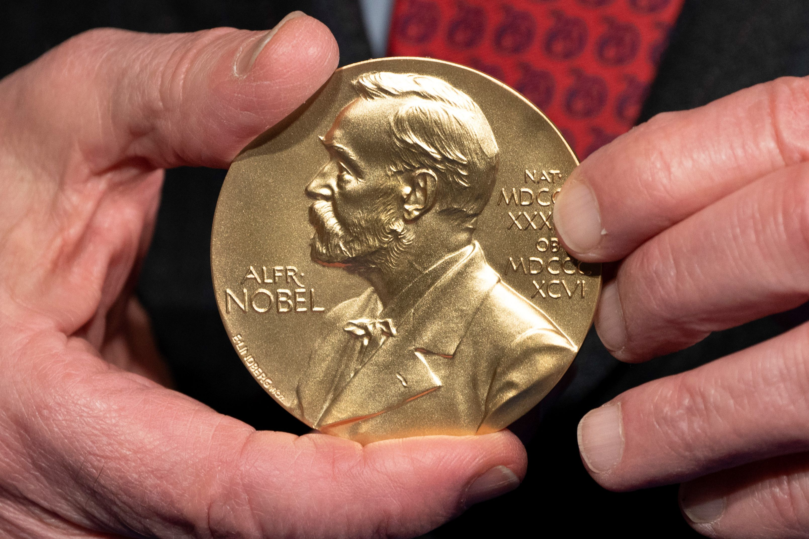
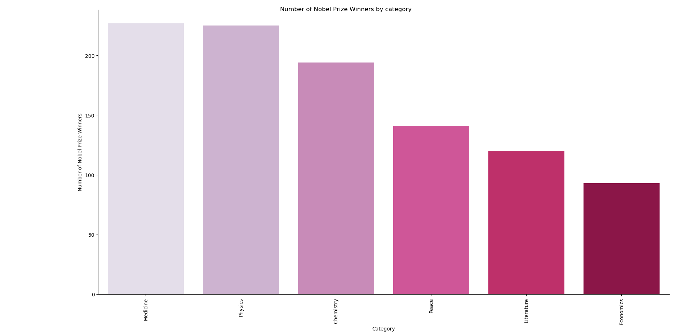
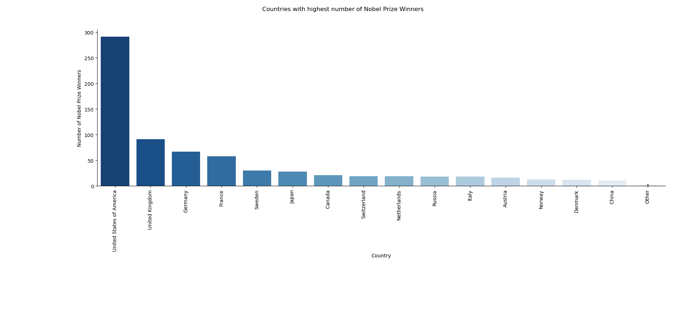
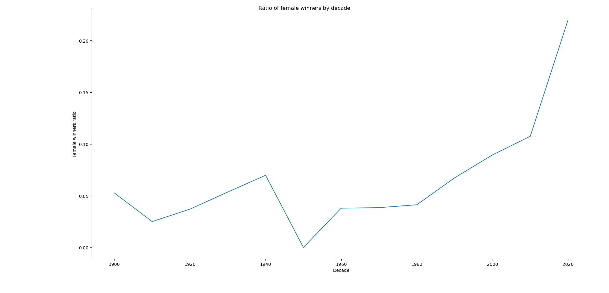

# 🏅 What I found about the last 1000 Nobel Prize Winners:

## 🔍 Overview:

👨🏻‍🔬 There have been more male Nobel winners (905) then female winners (65), the other 30 winners belong to organizations.

💡 A total of 6 science fields have witnessed Nobel Winners including:
    
    - Medicine 🩹
    - Physics ⚛️
    - Chemistry ⚗️
    - Peace 🕊️
    - Literature 📜
    - Economics 💰

🔹 *Of those 6 categories, Medicine (227) and Physics (225) have had the highest number of Nobel Prize Winners.*

## 🌍 Top Countries:

🔹 There have been 129 countries with Nobel Prize Winners, 3 leading countries are:

    - The United States of America (291) 
    - The United Kingdom (91) 
    - Germany (67) 

## 👩‍🔬 About female winners:
🔹 The first female scientist to win the Nobel Prize is Marie Curie, she won the Nobel Prize in Physics for her study in spontaneous radiation in 1903.

🔹The ratio of female winners fluctuate significantly throughout the years.

🔹The 1950s had exactly 0 female winners, while the 2000s decade had the highest ratio - 22%.

## 🤔 Who have won it more than once ?

🔹 There have been 6 individuals and organizations have won more than 1 Nobel Prize:

    - Marie Curie:
        ⚛️ Physics (1903)
        ⚗️ Chemistry (1911)
    - Linus Carl Pauling:
        ⚗️ Chemistry (1954)
        🕊️ Peace (1962)
    - John Bardeen: 
        ⚛️ Physics (1956-1972)
    - Frederick Sanger:
        ⚗️ Chemistry (1958-1980)
    - International Committee of the Red Cross:
        🕊️ Peace (1917-1944-1954-1963)
    - Office of the United Nations High Commissioner for Refugees (UNHCR):
        🕊️ Peace (1981)
    
## 🧠 Skills used in this project:

    🔹Data handling and reading.
    🔹Working with csv file using Pandas.
    🔹Data manipulation using Pandas:
        - Counting
        - Sorting 
        - Grouping
        - Selecting
        - Filtering
        - Aggregating
    🔹Data visulization using Seaborn:
        - Line plot.
        - Categorical plot.
        - Plot customization (labels, title, color palette, layout)
*Data source: DataCamp*
