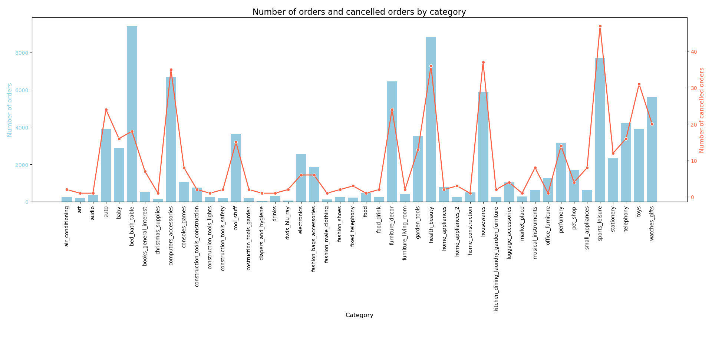
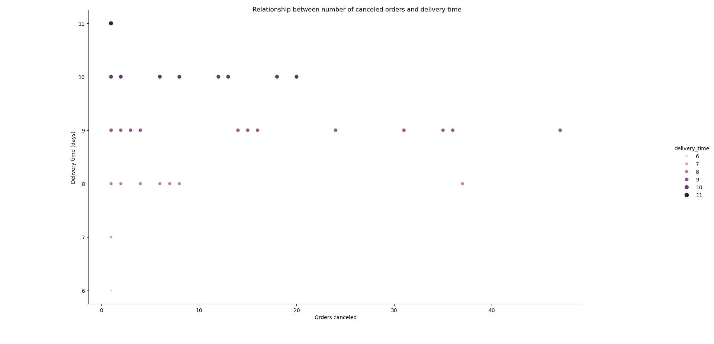
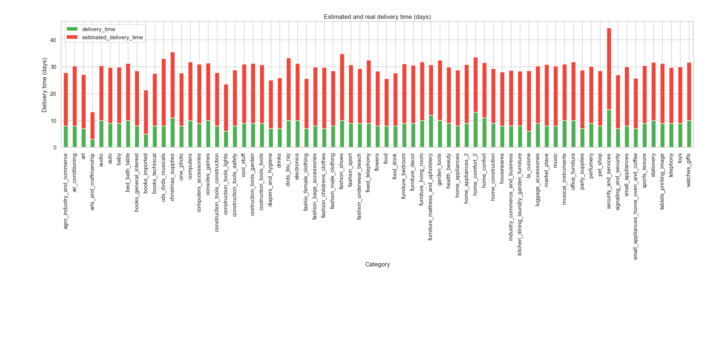

# ❌ What I found about order cancellation of Olist Ecommerce Marketplace

## 🔴 Cancellation rate:

🔹 The cancellation rate of Olist Ecommerce Marketplace is **0.005%**, only 446 out of 97991 total orders are canceled.

🔹 46 out of 71 product categories have orders that are cancelled, all of them have cancellation rate less than 1%.

## ❓ What helps Olist Ecommerce Marketplace have such low cancellation rate ?

## 🚚 Stable delivery time

🔹 The average delivery time of all 71 product categories is **8.7 days**, a relatively reasonable timeframe for an Ecommerce Marketplace operating in a large and geographically diverse country like Brazil.

🔹 The scatterplot below shows that most of the canceled orders have delivery time around 9 days - not far from the average delivery time. Very few canceled orders have delivery time longer than 10 days, indicating that Olist is doing good at stablizing delivery time, ensuring their customers have a clear expectation about when they can get their orders. 

## 💨 Faster delivery time than expected

🔹 All 71 product categories have shorter delivery time than what they announced to their customers when they placed an order, the average gap is **12.3 days earlier**.

## 🧠 Skills used in this analysis

🔸 Python:

    🔹Data handling and reading.
	🔹Working with CSV file using Pandas
	🔹Data manipulation with Pandas:
		- Merging 
	🔹Data visualization with Seaborn and Matplotlib:
		- Grouped bar chart
        - Dual y axis chart
		- Plot customization (labels, title, color palettes)

🔸 SQL (PostgreSQL):

	🔹 Joins
    🔹 Aggregating
	🔹 CTEs
