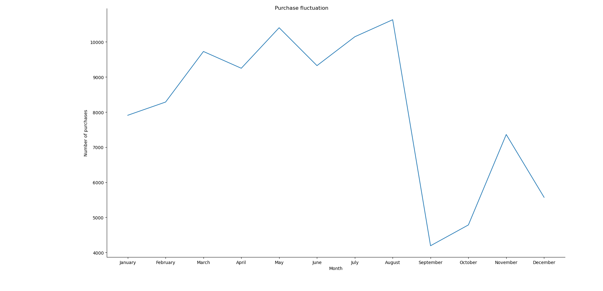
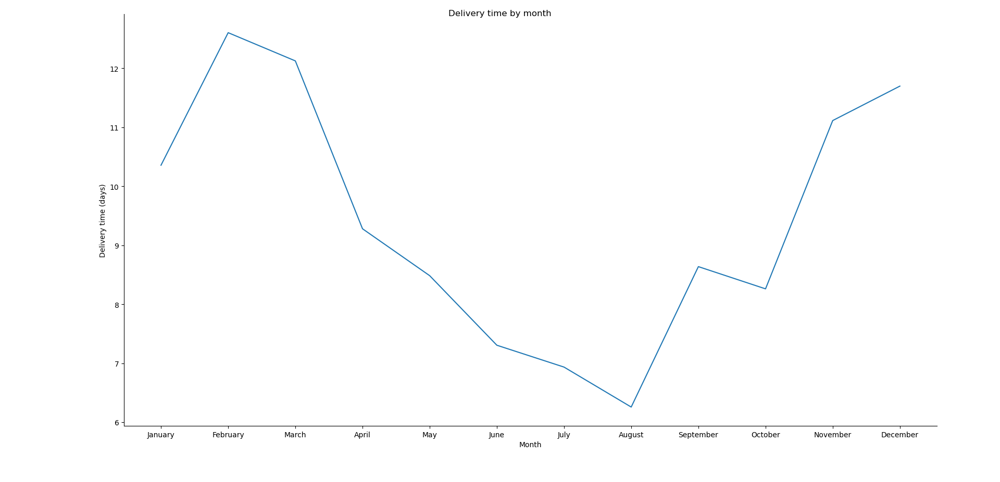
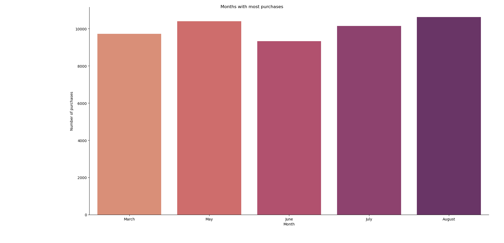
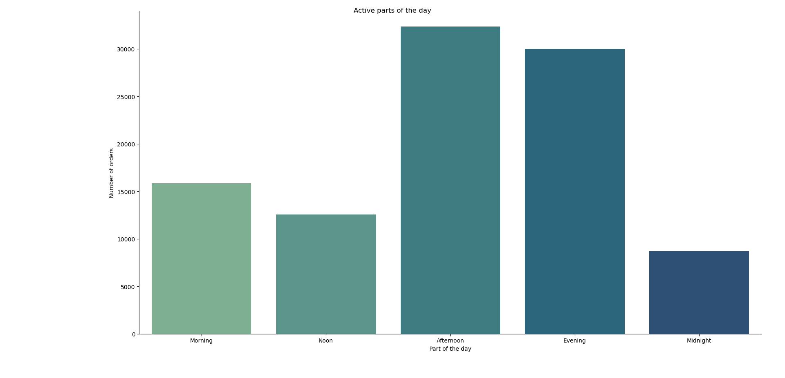

# 🔍 What I found about customer behavior of Olist ecommerce marketplace:

## 📈 Purchase fluctuation:

🔹 As we can see from the line chart, the fluctuation in the number of purchases is very significant, especially between August and September. This can be interpreted by the increase in delivery time:
- While August is the month with shortest delivery time **(6.25 days)**, September takes 2 days longer to complete an order **(8.64 days)**.

- September is the first month to witness an increase after a long period of declininf shipping time, so the drop in the purchase amount could be considered a response from customers.

 

## 🔝 Months with most purchases

🔹 May and August are the leading months in the number of orders completed, with 10404 and 10632 orders respectively.

🔹 What's noteable is that 4 out of 5 leading months are between the second and third quarter, indicating the most active months of Olist Ecommerce Marketplace's customers.

## ⏰ Most active parts of the day

🔹 Afternoon is the most active part of the day, when over 30000 orders (accounting for 32.54% of the total number) have been placed at this time.

🔹 Midnight, on the other hand, is the most quiet part, with only 8675 purchases during this day part.

## 🧠 Skills used in this project:

🔸 Python:

    🔹Data handling and reading.
	🔹Working with CSV file using Pandas
	🔹Data manipulation with Pandas:
		- Selecting 
		- Sorting 
	🔹Data visualization with Seaborn:
		- Bar chart
        - Line chart
		- Plot customization (labels, title, color palettes)

🔸 SQL (PostgreSQL):

	🔹 Joins
    🔹 Aggregating
    🔹 Sorting
	🔹 CTEs
