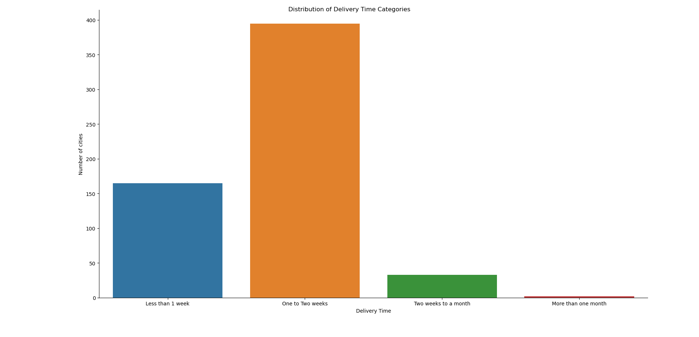
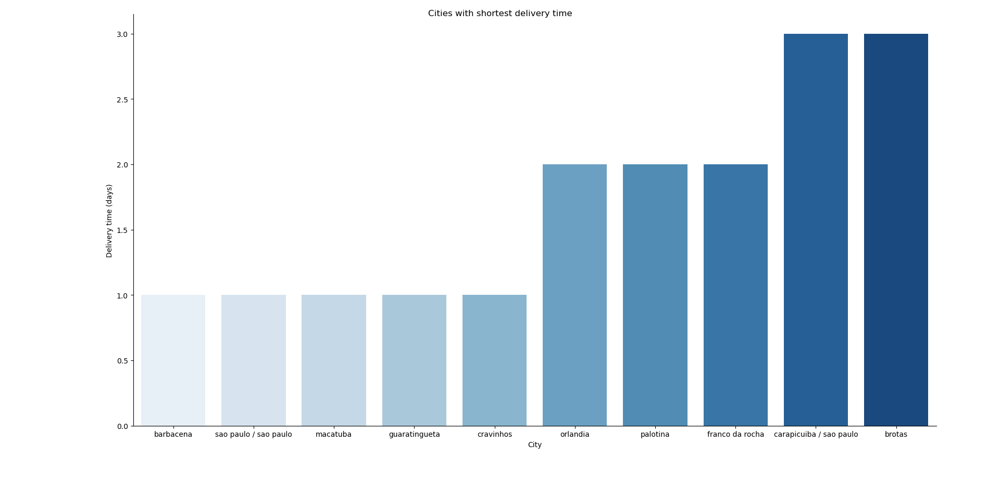
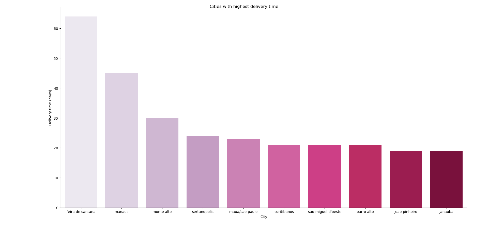

# 🚚 What I found about delivery time of Olist Ecommerce Marketplace

## 🔎 Overview:

⏳ Average delivery time: 9.3 days.

🏙️ Most cities take 1-2 weeks of delivery time.

📊 Delivery time distribution:

## 🔝 Top 10 Cities Leading In Delivery Time:

	- Barbacena
	- São Paulo
	- Macatuba
	- Guaratinguetá
	- Cravinhos
	- Orlândia
	- Palotina
	- Franco da Rocha 
	- Carapicuíba
	- Brotas

✅ *Those cities average 1.7 days to complete an order.*

✅ *The first 5 cities only take 1 day to complete an order.*

### 📊 Bar chart:

## 🛑  Top 10 cities With Slow Delivery Time:

	- Feira de Santana
	- Manaus
	- Monte Alto
	- Sertanópolis
	- Mauá
	- Curitibanos
	- São Miguel d'Oeste
	- Barro Alto
	- João Pinheiro
	- Janaúba  

⚠️ *Those 10 cities average 28.7 days to complete an order.*

⚠️ *Of those, Feira de Santana takes the longest to deliver (64 days).*

### 📊 Bar chart:

## 🗒️Key Takeaways:

- While some cities deliver in just 1-2 days, others take more than 2 months.

- The distribution of delivery time is not even, and there are some cities which can be seen as outliers such as Fiera de Santana (64 days) and Manaus (45 days).

## 🧠 Skills used in this analysis:

🔸 Python:

	🔹Data handling and reading.
	🔹Working with CSV file using Pandas
	🔹Data manipulation with Pandas:
		- Filtering
		- Selecting 
		- Aggregating
		- Sorting 
	🔹Numerical operations using NumPy 
	🔹Data visualization with Seaborn and Matplotlib:
		- Bar chart
		- Plot customization (labels, layout, title, color palettes)

🔸 SQL (PostgreSQL):

	🔹 Joins
    🔹 Aggregating
    🔹 Sorting
	🔹 CTEs
