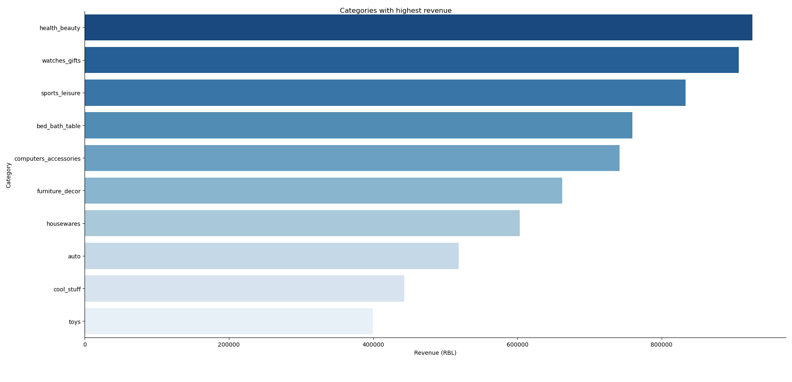
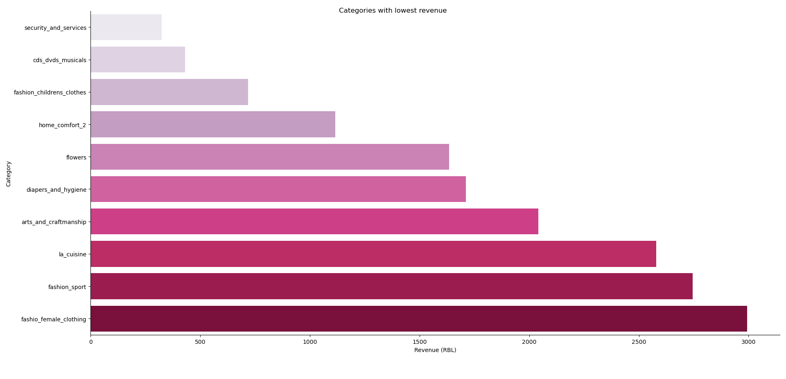

# 💰 What I found about revenue by product category of Olist Ecommerce Marketplace:

## 💸 Average revenue: *157616.16* RBL.

## 🔝 Top 10 product categories leading in revenue:

    - Health and Beauty
    - Watches and Gifts
    - Sports and Leisure
    - Bed, bath and table
    - Computer accessories
    - Furniture decoration
    - Housewares
    - Auto
    - Cool stuff
    - Toys

✅ *Those 10 categories average **679431.236** RBL in revenue.*

✅  *Health and Beauty has the highest revenue with **926020.44** RBL.*

### 📊 Bar chart:

## ⬇️ 10 product categories with lowest revenue:

    - Security and Services
    - Musical CDs and DVDs
    - Children fashion clothes
    - Home comfort (2)
    - Flowers
    - Diapers and Hygiene
    - Arts and Craftmanship
    - Cuisine
    - Sport fashion
    - Female fashion clothing
    
✅ *Those 10 categories average **1629.6** RBL in revenue.*
    
✅  *Securities and Services category has the lowest revenue (**321.51 RBL**).*

### 📊 Bar chart:

## 📝 Key takeaways:

- The revenue of the bottom 10 categories are **677801.64 RBL (99.76%)** lower than that of the top 10 categories.
- The distribution of revenue in Olist ecommerce marketplace is uneven.

## 🧠 Skills used in this project:

🔸 Python:
    
    🔹 Data handling and reading.
    🔹 Working with CSV files using Pandas.
    🔹 Data malnipulation using Pandas:
        - Sorting
        - Selecting
        - Aggregating
    🔹 Data visulization using Seaborn and Matplotlib:
        - Bar chart
        - Plot customization (layout, labels, title, color palettes)

🔸 SQL (PostgreSQL):

    🔹 Joins
    🔹 Aggregating
    🔹 Sorting
    🔹 CTEs
    🔹 Logical operations
