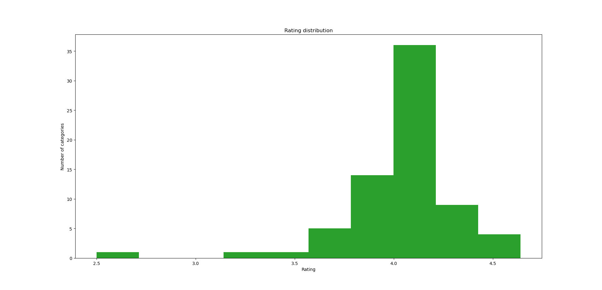
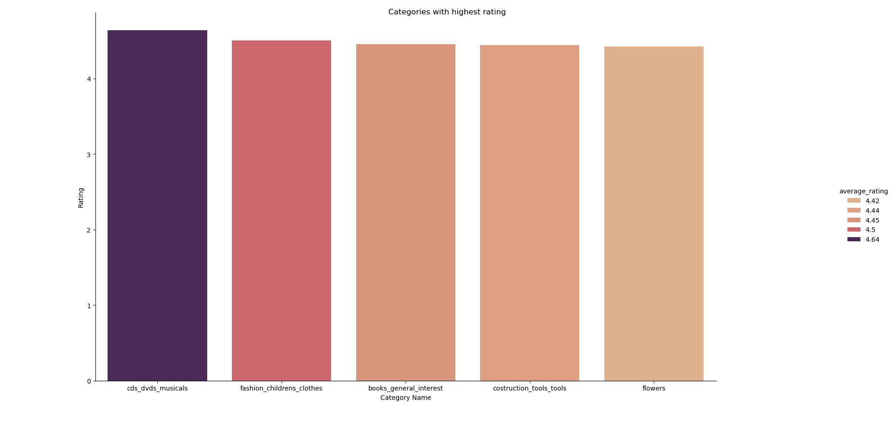
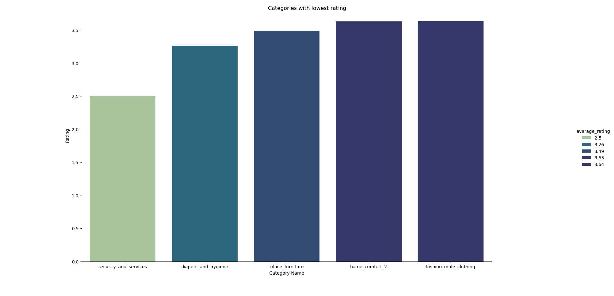
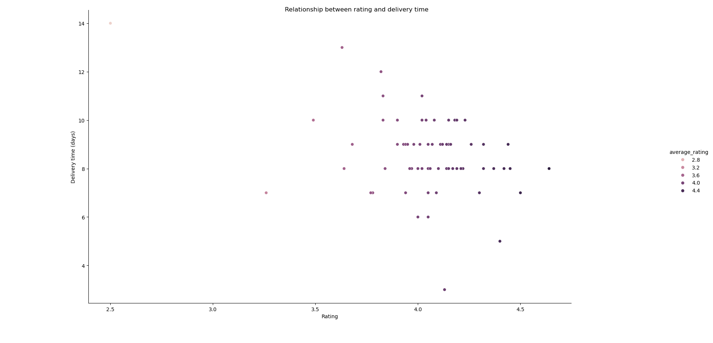
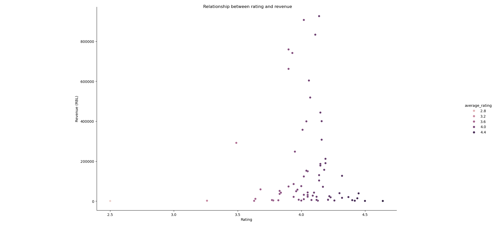
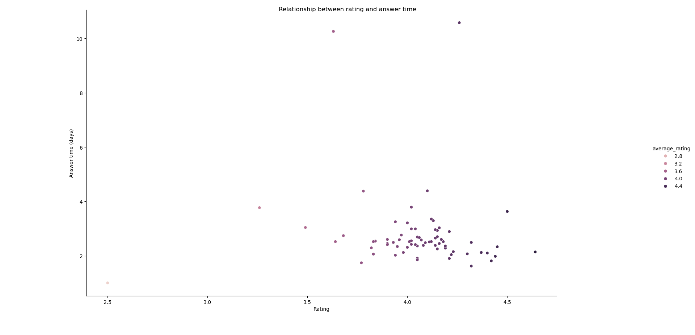

# ⭐ What I found about product rating of Olist Ecommerce Marketplace:

## 🔍 Overview:

🔹 The average rating of 71 product categories is **4.04** out of **5** stars.

🔹 Most of the categories have rating from **3.7** to **4.2** stars.

## 🔝 Categories with highest rating:

🔹 5 categories with highest rating are:
    
    - Musical DVDs and CDs
    - Children fashion clothes
    - General interest books
    - Construction tools
    - Flowers

*🏆 Of those, musical DVDs and CDs have the highest rating with **4.64** stars.*

## 🔴 Categories with low rating:

🔹 5 categories with lowest rating are:
    
    - Security and services
    - Diapers and hygiene
    - Office furniture
    - Home comfort (2)
    - Male fashion clothing

*⚠️ Of those, security and services have the worst rating with only **2.5** stars.*

## 🚚 Rating and delivery time:

❓ Is there any relationship between rating and delivery time ?

🔹 We might think that the shorter the delivery time, the higher the rating. This is quite true for Olist ecommerce marketplace, since there seems to be a negative linear relationship between delivery time and rating, though the relationship is quite weak.

🔹 The correlation between delivery time and rating is **-0.41**.

## 💰 Rating and revenue:

❓ Is there any relationship between rating and revenue ?

🔹 There seems to be no apparent linear relationship between a category's rating and revenue. But categories with high revenue often have high rating.

🔹 The correlation between rating and revenue is **-0.005**.

## 🚢 Rating and delivery cost:

❓ Is there any relationship between rating and shipping cost ?

🔹 Like rating and revenue, there is no apparent linear relationship between a category's rating and shipping cost.

🔹 The correlation between rating and shipping cost is **-0.06**.

## ⏰ Rating and review answer time:

❓ Is there any relationship between rating and time taken to reply to a review ?

🔹 Most categories with high rating often take less time to reply to a review. Sport fashion is the only category that has long answer time *(10.58 days)* but still of high rating *(4.26 stars)*.

🔹 The correlation between rating and shipping cost is **-0.05**.

## 🗒️ Key takeaways:

🔹 The average rating of 71 categories is **4.04 stars**.

🔹 Musical DVDs and CDs have the highest rating **(4.64 stars)**, the lowest rating is securities and services **(2.5 stars)**.

🔹 The shorter the delivery time, the higher the rating.

🔹 Higher rating is often associated with short answer time and low delivery cost.

🔹 No apparent relationship between rating and revenue.

## 🧠 Skills used in this analysis:

🔸 Python:
    
    🔹 Data handling and reading.
    🔹 Working with CSV files using Pandas.
    🔹 Data malnipulation using Pandas:
        - Sorting
        - Selecting
        - Aggregating
        - DataFrame merging
    🔹 Data visulization using Seaborn and Matplotlib:
        - Histogram
        - Scatterplot
        - Bar chart
        - Plot customization (layout, labels, title, color palettes)

🔸 Statistics

🔸 SQL (PostgreSQL):

    🔹 Joins
    🔹 Aggregating
